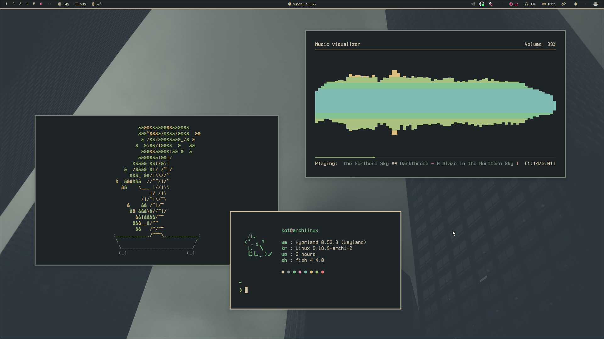
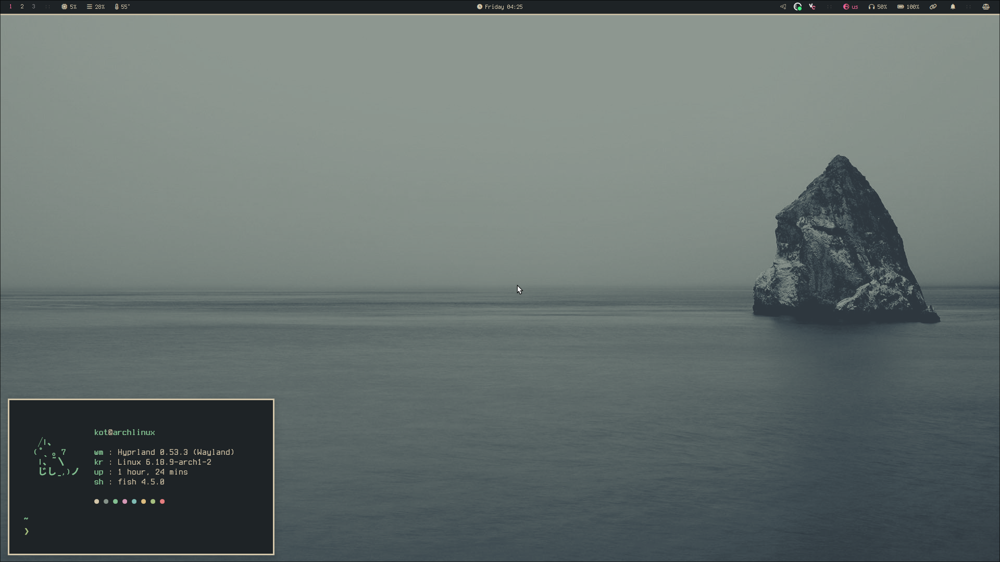

<!DOCTYPE html>
<html lang="ru">
<head>
    <meta charset="UTF-8">
</head>
<body>

    
    

<blockquote>
    
🌐 <strong>Language / Язык:</strong> <a href="README.md">English</a> | <a href="README.ru.md">Русский</a>

</blockquote>

<h2>Описание</h2>

Конфигурации для Wayland окружения на базе Hyprland с акцентом на минимализм и кастомные темы оформления.

<h2>Компоненты</h2>

<h3>Оконный менеджер</h3>
<ul>
    <li><strong>Hyprland</strong> — Wayland композитор</li>
</ul>

<h3>Интерфейс</h3>
<ul>
    <li><strong>Waybar</strong> — Панель задач</li>
    <li><strong>Rofi</strong> — Лаунчер приложений</li>
    <li><strong>SwayNC</strong> — Центр уведомлений</li>
</ul>

<h3>Терминал</h3>
<ul>
    <li><strong>Kitty</strong> — Терминал</li>
</ul>

<h3>Утилиты</h3>
<ul>
    <li><strong>Fastfetch</strong> — Системная информация</li>
    <li><strong>Matugen</strong> — Генератор цветовых схем</li>
    <li><strong>Zathura</strong> — PDF-ридер</li>
</ul>

<h3>Темы</h3>
<ul>
    <li><strong>Кастомные темы</strong> — Собственные цветовые схемы и темы оформления в директории <code>Themes/</code></li>
</ul>

<h3>Скрипты</h3>
<ul>
    <li><code>rofi-tabs.sh</code> — Меню важных категорий</li>
    <li><code>themes_menu.sh</code> — Меню выбора тем</li>
    <li><code>trigger_menu.sh</code> — Меню триггеров</li>
    <li><code>wallpaper_menu.sh</code> — Меню выбора обоев</li>
</ul>

</body>
</html>
