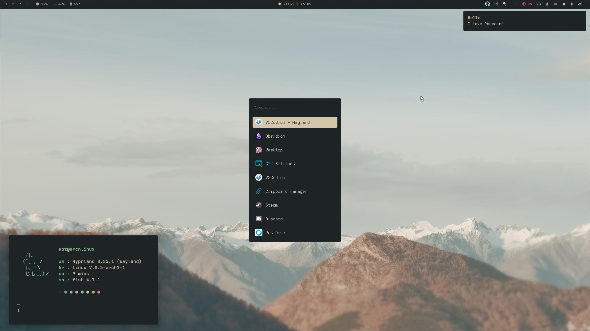
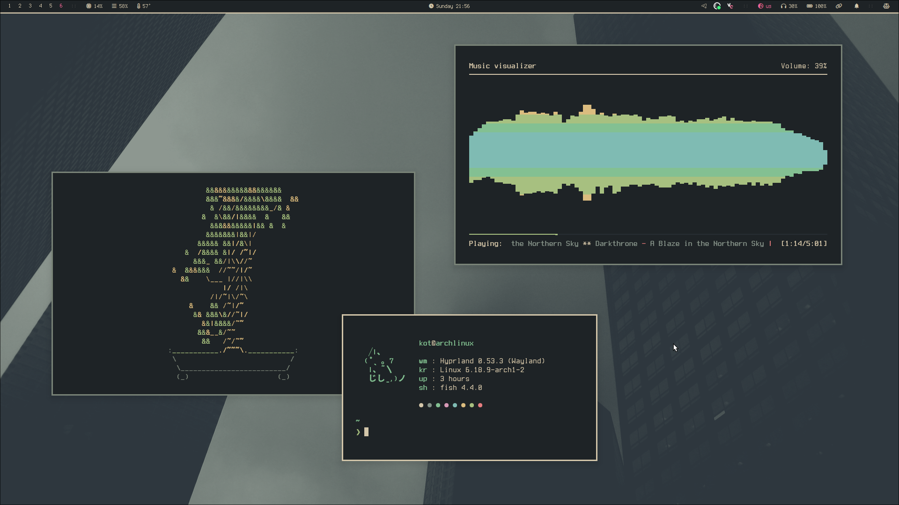
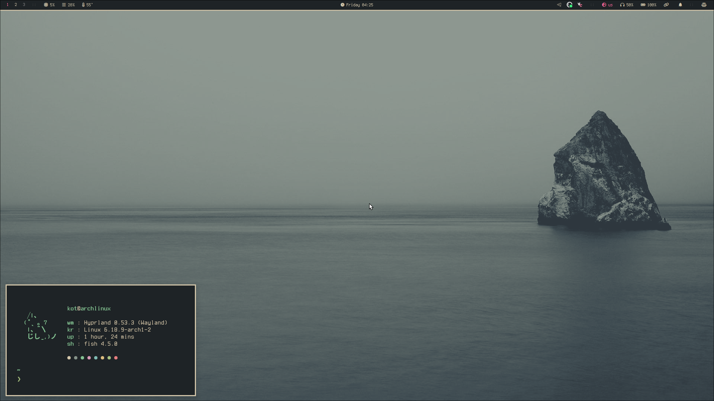

    

🌐 **Language / Язык:** [English](readme.md) | [Русский](readme.ru.md)

---

## Компоненты

| Тип                  | Программа            |
| ----------------------| ----------------------|
| WM                   | hyprland             |
| Терминал             | kitty                |
| Оболочка             | fish                 |
| Редактор             | nvim, vscodium       |
| Файловый менеджер    | thunar, nautilus     |
| Панель               | waybar               |
| Браузер              | firefox, zen browser |
| Просмотр изображений | ristretto, swayimg   |
| Просмотр документов  | zathura              |
| Видеоплеер           | mpv                  |
| Музыка               | ncmpcpp              |

### Темы
Собственные цветовые схемы и темы находятся в директории `Themes/` (в процессе совершенствования...)

### Скрипты
- `rofi-tabs.sh` — Меню важных категорий
- `themes_menu.sh` — Меню выбора темы
- `trigger_menu.sh` — Меню триггеров
- `wallpaper_menu.sh` — Меню выбора обоев (matugen)
- `rofi-read.sh` — Меню чтения PDF книг (открывает выбранную книгу из ~/Books через zathura)
- `sync.sh` — Скрипт синхронизации dotfiles (rsync + логирование + git интеграция)
- `dotfiles_push.sh` — Git коммит и пуш через rofi

## Горячие клавиши

| Сочетание         | Действие                          |
| -------------------| -----------------------------------|
| Super + Q         | Открыть терминал                  |
| Super + C         | Закрыть активное окно             |
| Super + M         | Выйти из Hyprland                 |
| Super + E         | Thunar                            |
| Super + Shift + E | Nautilus                          |
| Super + B         | Firefox                           |
| Super + Shift + B | Zen Browser                       |
| Super + V         | Переключить плавающий режим       |
| Super + L         | Hyprlock                          |
| Super + W         | Перезагрузить Waybar + Hyprctl    |
| Super + F1        | Rofi Tabs (rofi-tabs.sh)          |
| Super + F2        | Очистить кэш шрифтов и GTK CSS    |
| Super + K         | Hyprctl kill                      |
| Super + R         | Rofi (drun)                       |
| Super + .         | Rofi — выбор эмодзи               |
| Super + N         | Rofi — калькулятор                |
| Super + Space     | Менеджер буфера обмена (cliphist) |
| Alt + Tab         | Hyprexpo                          |
| Super + P         | Hyprpicker                        |
| Print             | Скриншот всего экрана             |
| Shift + Print     | Скриншот выделенной области       |

---

## Старое

    
    

